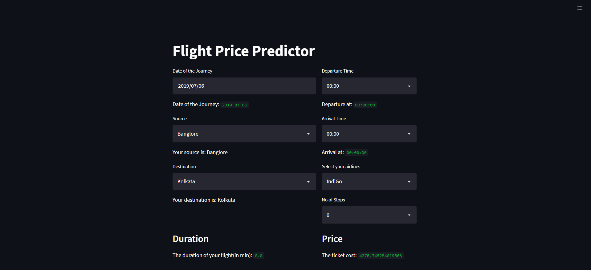

# Flight Fare Estimation App

The objective of this project is to predict the flight prices given the various parameters. Data was used from Kaggle which is a freely available platform for data scientists. 

Visit https://flight-fare-calculatorr.herokuapp.com/ to view the website.


## Technologies used in the project

1. Python
2. Numpy and Pandas for data cleaning
3. Matplotlib and Seaborn for data visualization
4. Sklearn for model building
5. Jupyter notebook, visual studio code as IDE
6. Streamlit
## Installation

The code is written in Python 3.6.10. If you don't have Python installed you can find it here. If you are using a lower version of Python you can upgrade using the pip package, ensuring you have the latest version of pip. To install the required packages and libraries, run this command in the project directory after cloning the repository:

```bash
pip install -r requirements.txt
```
    
## Deployement on Heroku

Login or signup in order to create virtual app. You can either connect your github profile or download ctl to manually deploy this project.

[](https://heroku.com)

Our next step would be to follow the instruction given on [Heroku Documentation](https://devcenter.heroku.com/articles/getting-started-with-python) to deploy a web app.
## Future Scope

* Integrating various APIs
* Front-End 


## Authors

- [Jenin Johna](https://github.com/JeninJP)
- [Sambitha P Santhosh](https://github.com/sambithaps)


